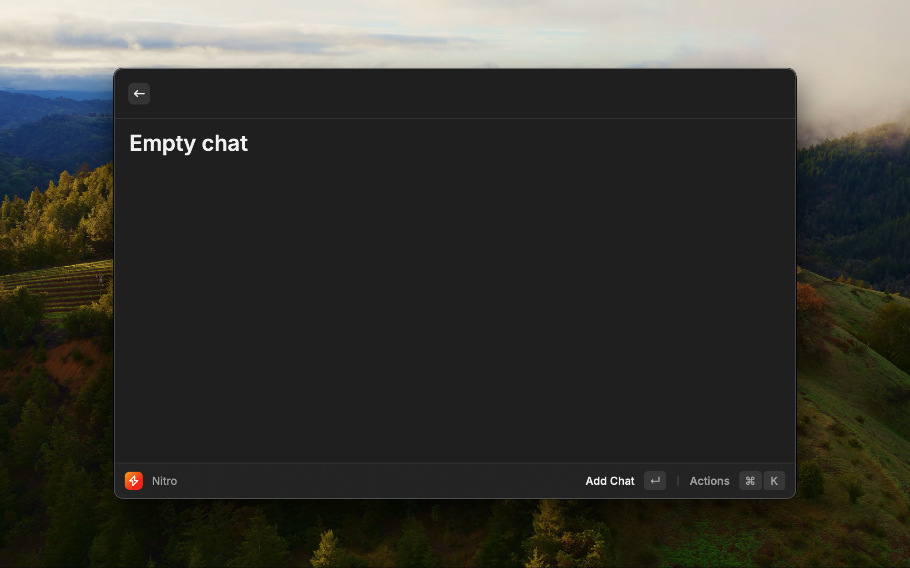
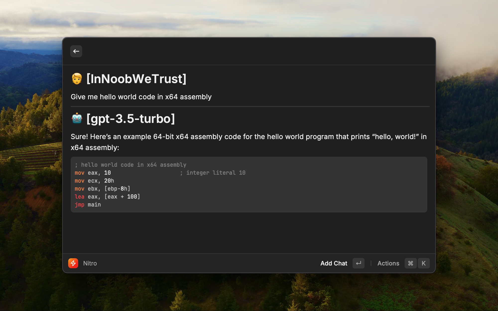
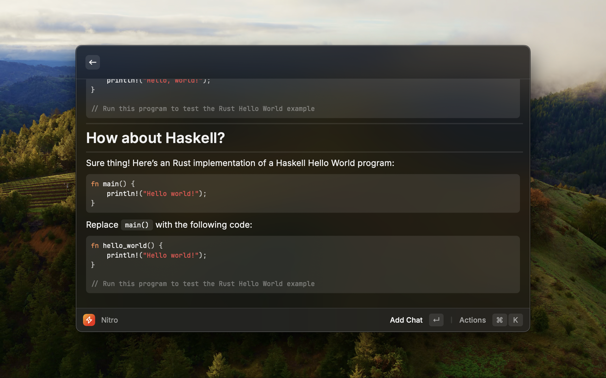
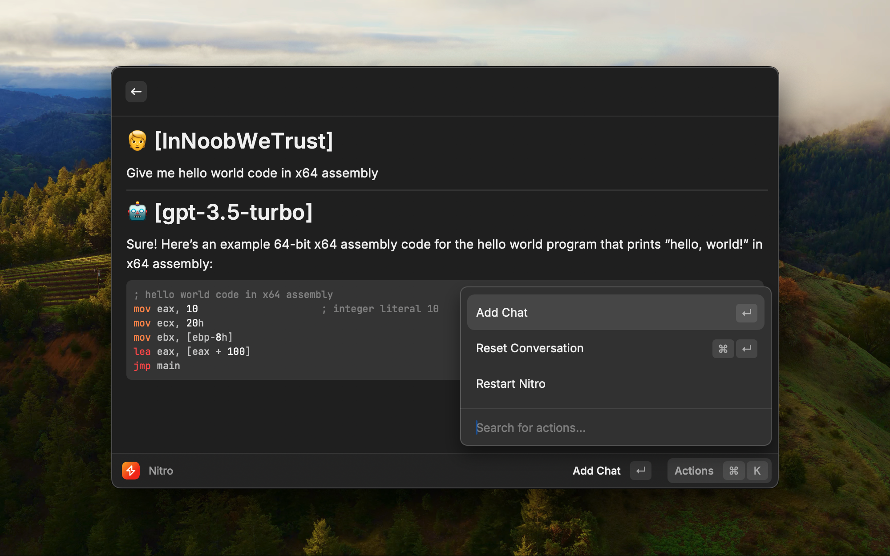
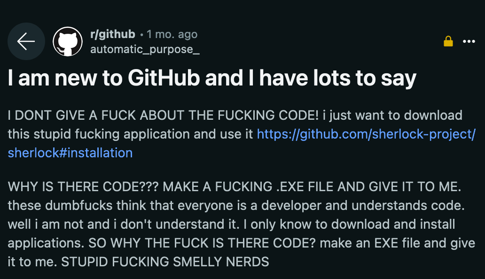

# nitro-raycast

Nitro raycast extension. Using LLM right from Raycast.

This is a shameless wrapper around [Nitro](https://github.com/janhq/nitro), to allow easy use in [Raycast](https://www.raycast.com/).

## Installation:

Sorry, no exe for you yet...😔

- [Buy a Mac machine](https://www.ebay.com/sch/i.html?_from=R40&_nkw=mac+mini&_sacat=0) (not sponsored by Apple, I'm not a Sheeple)
- Install [Raycast](https://www.raycast.com/)
- Clone the repo: `git clone https://github.com/InNoobWeTrust/nitro-raycast`
- Use either `main` branch for stable or `dev` for latest features
- Install dependencies: `npm install`
- Run the extension with dev mode: `npm run dev`
- After the extension is loaded and be able to run in Raycast, you can stop the dev mode with `Command + C`
- The extension is now ready to use

## TODO:

- [ ] Using `@janhq/nitro-node` when it is published on NPM instead of hacking around the installation hooks. See: [janhq/jan#1635](https://github.com/janhq/jan/issues/1635)
- [ ] Choice of installation directory and model directory.
- [ ] Auto check and update latest release of `nitro` or let user choose the version they want to use.
- [x] Let users choose models they want to use and download it automatically.
- [ ] Enhance the response with [wikipedia](https://github.com/dopecodez/wikipedia) based RAG context.
- [ ] Enhance the response with [cheat.sh](https://cheat.sh/) based RAG context for programming questions.
- [ ] Let users pick the `prompt_template` on the known list to try on the new model. If they accept the `prompt_template` it will be used.
- [ ] Let LLM (tiny-llama) helps guessing the best prompt template to use and highlight it to user.
- [ ] Experimenting with [llamafile](https://github.com/Mozilla-Ocho/llamafile) as an alternative to nitro, it supports multiple platforms with ease thanks to [cosmopolitan libc](https://github.com/jart/cosmopolitan), but not as many features as nitro.
- [ ] Option to use [hugging-chat-api](https://github.com/Soulter/hugging-chat-api) instead of running models locally? Am I going to abuse their servers?!?
- [ ] Use this experiment as a learning to build standalone apps using Bevy (game engine in Rust) for backend and webview (vanilla JS) for UI. This choice is shamelessly inspired from Samsung's SmartThings mobile app architecture design (don't sue me for knowing too much 🥸 ). Initial choices: [hotkey](https://crates.io/crates/bevy_global_input), [webview binding](https://github.com/Boscop/web-view/blob/master/webview-examples/examples/timer.rs)
- [x] Be really lazy and summon Llamas to work for me by utilizing Raycast.

## Goals:

- [ ] Don't abandon this project like other pet projects in the past (most even never leave local machine)
- [ ] Summon as many Lllamas as possible.
- [ ] Make my robot waifu become real!

## Contributing:

As long as you accept weird combinations of libraries, then you are welcomed. My personal project, my choice of how to code it!

Brief of the code flow:

- All logical code is reactive and can run anywhere without React context. Everything is stream of values (observable), you manipulate it by piping operations and subscribe to the stream to listen to changes. Simple!
- React is just for rendering as I'm forced to use it to make it work in Raycast. Best choice for maintenance is to go with no UI library, RxJS + template literals + query selector are all you need for the front-end UI, no need to use React/Angular/Vue/etc!
- Limit the use of state as managing state is not needed, calling `useState` is just to leverage the batching of state changes in rendering cycle of React. Remember, everything is reactive except the UI due to the constraint of React (virtual DOM and diffing)!
- Hooks are for converting observables into React states.
- Init and destroy reactive observables by a single `useEffect` call in the component or React context.

Main reasons for the weird choices:

- I don't want to chase front-end UI libraries/frameworks and waste my time maintaining the UI. ReactiveX is everywhere, can help me on almost anything I want, and is around since 2011, I have faith in it over the daily birth rate of front-end UI libraries/frameworks.
- Easy portability to desktop and mobile, thanks to support on almost all platforms of ReactiveX. Just need to switch the view implementation for other platforms without needing to change much on the logical code (logical flow stays almost the same).
- For now I just want to use the most reliable things so I don't have to migrate the legacy shits of myself or others in the incident of backward-incompatible changes in the libraries. Component class, then hooks, then useSignal instead of useState... What's next, abandon all and use Rust for everything?
- My focus is on bringing ideas to real products, so programming languages and frameworks are not my concern, I just pick the best possible tool for the job and current context. As long as programming concepts are the same as the 1970s and 1980s, it's all good (one exception is the ownership concept from Rust).
